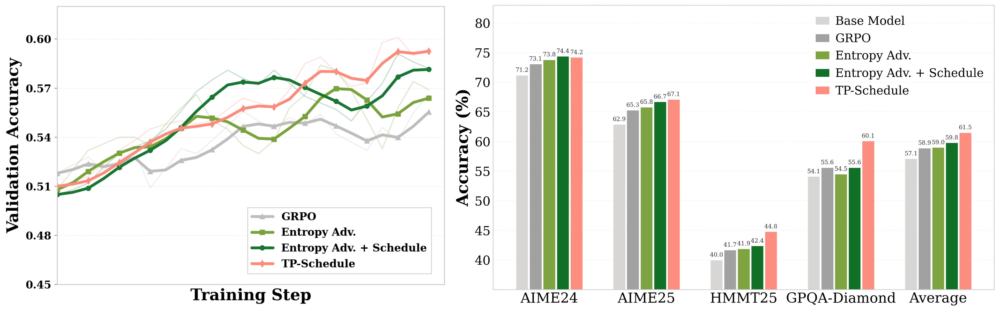
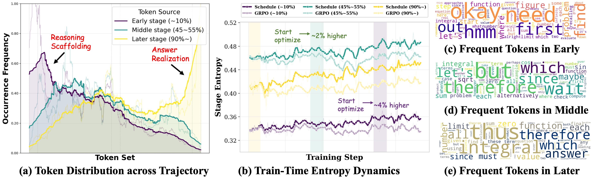
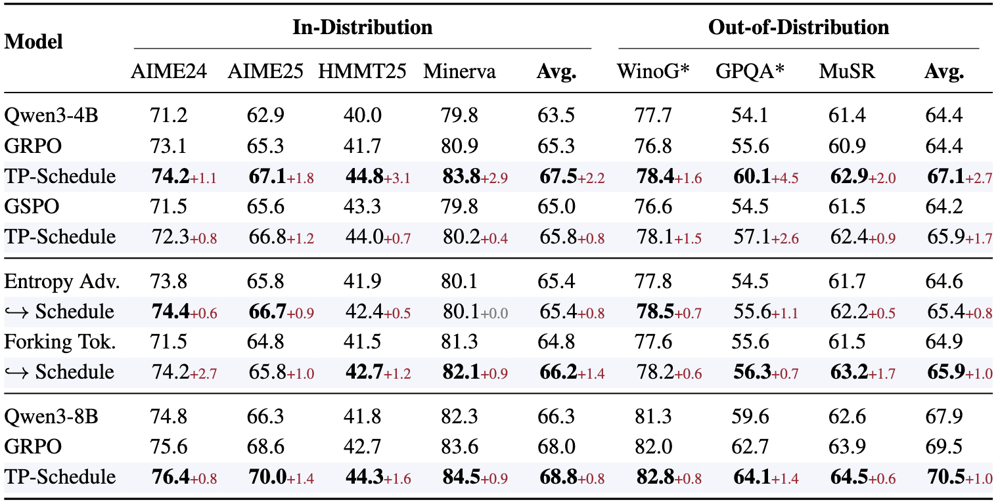

<div align="center">
<h1 align="center"> Not Only Where, But When: Temporal Scheduling for RLVR</h1>

<a href='https://arxiv.org/pdf/2510.10201'></a>
<a href='https://jinghaoleven.github.io/RLFR/'></a>
<a href='https://huggingface.co/datasets/JingHaoZ/OpenReasoning'></a>

</div>

## 🔥 News
- [2026.05.23] 🔥🔥 We release the [paper](https://arxiv.org/pdf/2510.10201), [code](https://huggingface.co/collections/JingHaoZ/rlfr-68e9046eaeb8207e868a4f02) and [dataset](https://huggingface.co/datasets/JingHaoZ/OpenReasoning) of RLVR-Schedule.

## 📜 Brief Introduction
We introduce the temporal schedule of RLVR and show that *when* learning signals are scheduled can be as important as *where* they are allocated across trajectory tokens, and thus extending existing credit allocation approaches with temporal dimension over the course of RLVR optimization. 

💡 **Continuous Reasoning Enhancement.** Temporal schedule of RLVR shows consistent progress in advancing reasoning capabilities over RLVR with stagnant stagnant credit allocation paradigm, including advantage reweighting and sparse token optimization.
<div align="center">  </div>

🛠️ **Trajectory Percentile Schedule.** We identify that the simple trajectory percentiles (TP-Schedule) provides a natural perspective in distinguishing heterogeneous policy behaviors, and effectively anchoring the policy entropy in optimizaiton, suggesting a promising credit allocation criteria for temporal scheduling.
<div align="center">  </div>

📈 **Temporal Scheduling Analysis.** Temporal scheduling of RLVR show consistent
<div align="center">  </div>

## 🔧 Environment Set Up
1. Clone this repository and navigate to the folder:
```bash
git clone https://github.com/Jinghaoleven/RLVR-Schedule.git
cd RLVR-Schedule
```

2. Install dependency:
```bash
conda create -n rlvr_schedule python==3.12 -y
conda activate rlvr_schedule

pip3 install vllm==0.11.0
pip3 install flash-attn==2.8.3 --no-build-isolation --no-cache-dir
pip install -e .
```

## 💻 Training

#### 1. Prepare data

Download the [OpenReasoning](https://huggingface.co/datasets/JingHaoZ/OpenReasoning) dataset, and move to `./datasets/OpenReasoning`.
```bash
huggingface-cli download --repo-type dataset --resume-download JingHaoZ/OpenReasoning --local-dir ./datasets/OpenReasoning
```

#### 2. Training
Default to trajectory percentile temporal schedule, run the training scipt.
```bash
bash examples/grpo_trainer/run_schedule_4b.sh
```

## Temporal-Schedule arguments

| Argument | Description |
|---|---|
| `data.schedule_strategy` | Chooses the scheduling method. `tp_schedule` uses trajectory-percentile scheduling, `forking_tok_schedule` schedules around high-entropy forking tokens, and `entropy_adv_schedule` applies an entropy-shaped advantage schedule, `off_policy_schedule` reuses scheduled context from off-policy responses when available. |
| `data.min_schedule_ratio` | Schedule start ratio in `[0, 1]` relative to `total_training_steps`. For example, `0.1` starts schedule at `10%` of training. |
| `data.max_schedule_ratio` | Schedule end ratio in `[0, 1]` relative to `total_training_steps`. For example, `0.8` finishes schedule at `80%` of training. |
| `data.schedule_mode` | Schedule curve between the resolved start and end steps. Supported values are `linear`, `sigmoid`, and `gamma`. |

## 🎓 Acknowledgements
We acknowledge the outstanding open-source contributions from [Verl](https://github.com/verl-project/verl) for building our codebase.
Thanks to all the contributors!

## ⭐ Citation
Please leave us a star ⭐ if you find this work helpful, and consider cite our paper!
```
@article{zhang2026notonlywhen,
  title={Not Only Where, But When: Temporal Scheduling for RLVR},
  author={Zhang, Jinghao and Li, Ruilin and Zhao, Feng and Wang, Jiaqi},
  journal={arXiv preprint arXiv:},
  year={2026}
}
```
